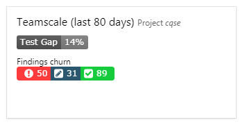
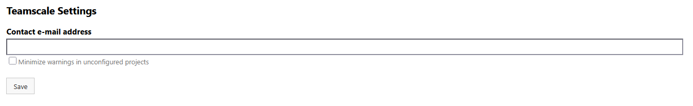
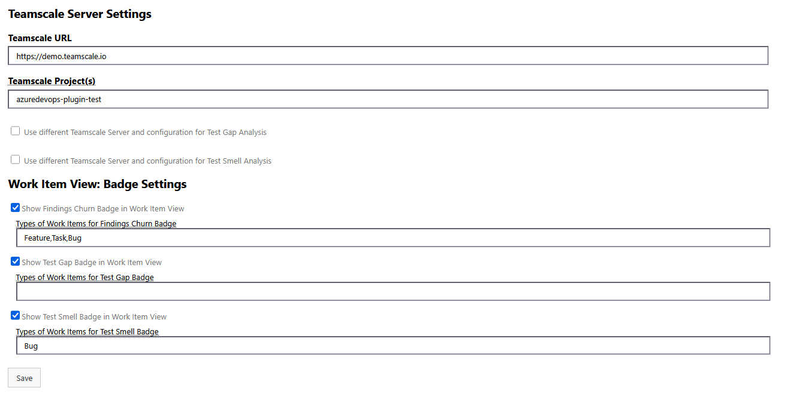
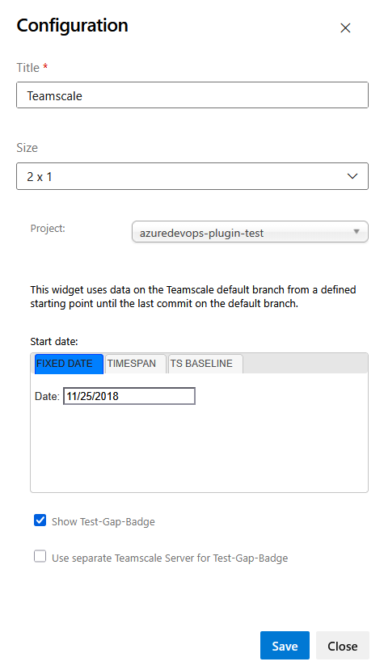

The Teamscale DevOps Extension was designed to integrate results of Source Code Analyses and Test Analyses of a [Teamscale](https://www.teamscale.com/) Instance to Azure DevOps and provides a build step that uploads coverage recorded during test execution or other reports in the build to a Teamscale server.

This Extension works with Azure DevOps Services as well as with Azure DevOps Server (on premise installation).

# Features
The extension provides two main integration points:

1. Integration of Analysis Results from Teamscale as
    * **Work Item Contribution**: Display Teamscale analysis results directly in Azure DevOps work items
    * **Dashboard Widget**: Show project-level metrics on Azure DevOps dashboards
2. **Report Uploader**: Upload coverage and other reports from build pipelines to Teamscale

## Work Item Integration
If your project uses work items (tickets) for development, you can get insights into code quality and test coverage directly in your work items.
The extension supports three types of badges:

1. **Findings Churn Badge**: Shows how many findings were introduced or resolved by the work item's changes.
2. **Test Gap Badge**: Displays test gap information for the code changes associated with a work item.
3. **Test Smell Badge**: Shows the presence and count of test smells associated with a work item.

## Dashboard Widget
The Dashboard Widget can be configured to display a Findings Churn Badge and a Test Gap Badge for the corresponding Azure DevOps project.
Integration into the dashboard gives a quick overview of how the project evolved since a specific baseline or for the last days or months.

## Upload Coverage or Other Reports to Teamscale
Coverage or other reports that are created during the build can be uploaded to Teamscale for further analysis.

# Setup
The upload to Teamscale and the integration of analysis results from Teamscale are configured independently.

## Configuring the Report Uploader
Add the Task "Teamscale Report Uploader" to the build pipeline and fill in the configuration form:
* _Display name_: The name of this build step as shown in the pipeline's UI.
* _Files_: The file(s) to be uploaded. Wildcards can be used. For example, `**/*.coverage` for all `.coverage` files in all subfolders.
* _Report Format ID_: The type of report this build step will upload to Teamscale. Please refer to the [Teamscale documentation](https://docs.teamscale.com/reference/upload-formats-and-samples/#supported-formats-for-upload) for a complete list of supported formats and their IDs.
* _Teamscale URL_: The URL of the Teamscale server. Please make sure that the Teamscale server is reachable from your Build Agent.
* _Username_: The name of the Teamscale user used to perform the upload.
* _IDE Access Key_: The IDE access key of the Teamscale user used to perform the upload. You can generate one for the user in Teamscale under _Admin > Users_. Alternatively, you can specify the (secret) variable `teamscale.accessKey` in the pipeline settings or the environment variable `TEAMSCALE_ACCESS_KEY`.
* _Teamscale Project_: The ID of the Teamscale project to which the reports should be uploaded. You can find these in the Projects perspective of Teamscale.
* _Partition_: An identifier under which the uploaded data will be grouped. Data uploaded into a partition will replace all previous data uploaded to that partition. For example, if you would like to upload multiple coverage reports for multiple test stages that all should be merged in Teamscale to calculate the line coverage metric, use different partitions for each upload.
* _Skip certificate validation_: Causes SSL certificates to be accepted without validation.
* _Path to custom trusted keystore_: By default, this plugin uses an embedded Java keystore to validate certificates. If you want to use a custom Java keystore, e.g. for self-signed certificates, you can specify the path to it here. You can find instructions how to create such a keystore [here](https://docs.teamscale.com/howto/connecting-via-https/#using-self-signed-certificates).
* _Password of the custom trusted keystore_: The password for the specified custom Java keystore. Alternatively, you can specify the (secret) variable `teamscale.keystorePassword` in the pipeline settings.
* _Print stack trace_: Enables printing stack traces in all cases where errors occur. Used for debugging.
* _Path to CodeCoverage.exe_: If you'd like to upload Visual Studio `.coverage` files to Teamscale, you must provide the path to `CodeCoverage.exe`. This file is used to convert the binary `.coverage` files to `.xml` files suitable for uploading to Teamscale. This plugin ships with a version of `CodeCoverage.exe`. If you prefer to use a different version, you'll have to configure the correct path to it here.
* _Batch size for coverage conversion_: The number of `.coverage` files to convert in one step using `CodeCoverage.exe`. Defaults to **1000**. Values <= 0 disable batch processing and all available files are converted at once. For very large numbers of files or very long file paths, this may result in "spawn ENAMETOOLONG" errors - in that case please configure a smaller batch size.

Please note that files in the Visual Studio Coverage format (`.coverage` binary files, format ID `VS_COVERAGE`) can currently only be processed on Windows agents.

## Configuring the Integration of Teamscale Analysis Results
For the Dashboard Widget and the Work Item Contribution, the extension can be configured at both the Organization and the Project level.

**Accessing the Extension Settings**
1. Open your organization or project - depending on which settings you want to access.
2. The settings page can be reached from the lower left corner of Azure DevOps, showing either "Organization Settings" or "Project Settings".
3. In the left sidebar under "Extensions", choose "Teamscale".

### Basic Settings

#### Contact e-mail address
In the extension's Organization settings you can define a "Contact e-mail address", which will appear to users in case of connectivity issues or other problems regarding the Teamscale Extension.

#### Teamscale Server
Both the Dashboard Widget and the Work Item Contribution require a Teamscale server to be configured.
Navigate to the extension's Project settings and fill in the fields in the "Teamscale Server Settings" section:
1. _Teamscale URL_: The URL of the Teamscale instance
2. _Teamscale Project(s)_ (only for the Work Item Contribution): The ID of the Teamscale project that is configured for the Azure DevOps project.
   Multiple projects (separated by a comma) can be specified in case an Azure DevOps project belongs to more than one Teamscale project.
   Information is then retrieved from the first project in the list that has relevant information for the respective item (e.g. findings for a work item when used for a findings badge).

##### Using Multiple Teamscale Servers
In some development environments, separate Teamscale servers are operated for the Test Gap Analysis (TGA) and the Test Smell Analysis (TSA) in addition to a Teamscale server for the static source code analysis.
Then you can specify different Teamscale servers for TGA and TSA here as well:
1. Enable the option _"Use different Teamscale Server and configuration for \[Test Gap or Test Smell Analysis\]"_
2. Enter the _"\[Test Gap or Test Smell\]: Teamscale URL_"
3. Enter the _"\[Test Gap or Test Smell\]: Teamscale Project(s)"_ (only for the Work Item Contribution)

### Configuring Work Item Badges
The Teamscale extension can add up to three different badges to Azure DevOps work items, providing visibility into code quality and testing metrics directly in your work item view.
Each badge type can be configured independently and requires different prerequisites.

The badges are configured in the extension's project settings (see the section [Accessing Settings](#basic-settings) for how to access them) and require the Teamscale server URL and projects to be configured (see [Basic Settings: Teamscale Server](#teamscale-server)).

#### Findings Churn Badge
##### Prerequisites
Before configuring the Findings Churn Badge, ensure the following prerequisites are met:
1. **Code Connector**: The Teamscale project must have an Azure DevOps Git connector configured to analyze your source code. See: [Azure DevOps Git connector documentation](https://docs.teamscale.com/howto/connecting-version-control-system/azure-devops-git/)
2. **Work Item Connector**: The Teamscale project must have an Azure DevOps Work Item connector configured to analyze your work items. See: [Azure DevOps Work Item connector documentation](https://docs.teamscale.com/howto/connecting-to-issue-trackers/azure-devops-work-items/)

##### Configuration Steps
To enable the Findings Churn Badge:
1. In the _"Work Item View: Badge Settings"_ section, enable the option _"Show Findings Churn Badge in Work Item View"_
2. [Optional] In the _"Types of Work Items for Findings Churn Badge"_ field, specify work item types that should display the badge:
    - Enter comma-separated work item types (e.g., "Bug, Feature, User Story")
    - Leave empty to show the badge on all work item types
    - Type names are case-insensitive

#### Test Gap Badge
##### Prerequisites
Before configuring the Findings Churn Badge, ensure the following prerequisites are met:
1. **Code Connector**: The Teamscale project must have an Azure DevOps Git connector configured to analyze your source code. See: [Azure DevOps Git connector documentation](https://docs.teamscale.com/howto/connecting-version-control-system/azure-devops-git/)
2. **Work Item Connector**: The Teamscale project must have an Azure DevOps Work Item connector configured to analyze your work items. See: [Azure DevOps Work Item connector documentation](https://docs.teamscale.com/howto/connecting-to-issue-trackers/azure-devops-work-items/)

##### Configuration Steps
To enable the Test Gap Badge using the default Teamscale server:
1. In the _"Work Item View: Badge Settings"_ section, enable the option _"Show Test Gap Badge in Work Item View"_
2. [Optional] In the _"Types of Work Items for Test Gap Badge"_ field, specify work item types that should display the badge:
    - Enter comma-separated work item types (e.g., "Bug, Feature, User Story")
    - Leave empty to show the badge on all work item types
    - Type names are case-insensitive

If you want to retrieve test gap information from a different Teamscale instance than the default one:
1. In the "Teamscale Server Settings" section, enable the option _"Use different Teamscale Server and configuration for Test Gap Analysis"_
2. Enter the _"Test Gap: Teamscale URL_" (the URL of the Teamscale instance used for test gap analysis)
3. Enter the _"Test Gap: Teamscale Project(s)"_ (the ID(s) of the project(s) that belong to the Azure DevOps project)

Both the URL and the projects must be entered when a different server is enabled (even if they are identical to the default server settings).

#### Test Smell Badge
##### Prerequisites
Before configuring the Test Smell Badge, ensure the following prerequisites are met:
1. **Requirements Management Tool Connector**: The Teamscale project must have a Requirements Management Tool connector configured to your Azure DevOps project (this connector is different from the Work Item connector used by other badges).

##### Configuration Steps
To enable the Test Smell Badge using the default Teamscale server:
1. In the "Work Item View: Badge Settings" section, enable the option _"Show Test Smell Badge in Work Item View"_
2. [Optional] In the _"Types of Work Items for Test Smell Badge"_ field, specify work item types that should display the badge:
    - Enter comma-separated work item types (e.g., "Test Case, Requirement")
    - Leave empty to show the badge on all work item types
    - Type names are case-insensitive

If you want to retrieve test smell information from a different Teamscale instance:
1. In the "Teamscale Server Settings" section, enable _"Use different Teamscale Server and configuration for Test Smell Analysis"_
2. Enter the _"Test Smell: Teamscale URL"_ (the URL of the Teamscale instance for test smell analysis)
3. Enter the _"Test Smell: Teamscale Project(s)"_ (project ID(s) for the Azure DevOps project)

Both the URL and the projects must be entered when a different server is enabled (even if they are identical to the default server settings).

#### Hiding Teamscale from Work Items
Please note that it is technically not possible to completely hide the entire "Teamscale" section when no badges are enabled.
The section is automatically added to all work items when the extension is installed.

As a workaround you can enable the option "Minimize warnings in unconfigured projects" in the extension's Organization settings.
The section is then at least automatically collapsed when no badges are enabled.

Alternatively, it is possible to remove the Teamscale section from specific work items types via Azure DevOps settings as described [here](https://learn.microsoft.com/en-us/azure/devops/organizations/settings/work/customize-process-field?view=azure-devops#hide-a-field-or-custom-control).
This has to be configured for each work item type individually.

#### Troubleshooting
If badges don't appear in your work items, check the following:

##### 1. Badge Not Enabled

**Symptom:** A specific badge is not displayed in any of the work items or no badges are displayed at all and an info message is shown: "Please activate at least one Badge for this work item type in the Project settings (Extensions → Teamscale)."

**Cause:** The badges are disabled in the extension settings

**Solution:**
- Go to Project Settings → Extensions → Teamscale
- Enable the respective badge by checking the "Show [Badge Type] Badge" checkbox and saving the configuration

##### 2. Wrong Work Item Type

**Symptom:** Badges appear on some work items but not others

**Cause:** The current work item type is not in the configured list

**Solution:**
- Go to Project Settings → Extensions → Teamscale
- Either add the work item type to the badge configuration (e.g., add "Epic" to the list)
- Or leave the work item types field empty to show badges for all work item types

##### 3. Teamscale Server Not Configured

**Symptom:** Error message "Teamscale is not configured for this project"

**Cause:** No Teamscale server URL is configured in the extension settings

**Solution:**
1. Go to Project Settings → Extensions → Teamscale
2. Enter the Teamscale URL in the "Teamscale URL" field
3. Enter at least one Teamscale project ID in the "Teamscale Project(s)" field
4. Save the configuration

##### 4. No Valid Project Data

**Symptom:** Error message "None of the configured Teamscale projects has valid [Badge Type] information for issue [ID]"

**Possible Causes:**
- The Teamscale project(s) are not configured correctly in the extension settings
- The work item ID is not tracked in any of the configured Teamscale projects

**Possible Solutions:**
- In the extension's project settings (Project Settings → Extensions → Teamscale), make sure that the "Teamscale Project(s)" field is filled correctly:
    - Contains the IDs of the projects, not their names
    - Project IDs are spelled correctly
    - When using a different server for the respective badge (i.e. a separate test gap server for the test gap badge and / or a separate test smell server for the test smell badge), check the respective option for the separate server, i.e. "Test Gap: Teamscale Project(s)" or "Test Smell: Teamscale Project(s)"
- Ensure that the Teamscale project has a work item connector (for findings and test gap badge) or requirements connector (for test smell badge) referencing your Azure DevOps project

### Dashboard Widget
The dashboard widget requires the Teamscale server URL and projects to be set in the extension's Project settings as described in [Basic Settings: Teamscale Server](#teamscale-server).

#### Adding the Widget to a Dashboard
To add the Teamscale widget to your Azure DevOps dashboard:
1. Open dashboard where you want to add the widget
2. Click the _Edit_ button in the top right
3. In the right sidebar under _"Add Widget"_, search for "Teamscale", select the widget and click _"Add"_
4. Drag and position the widget where you want it on the dashboard
5. Click _Done Editing_ to save your changes
After adding the widget to your dashboard, you need to configure it to display the desired metrics.

#### Opening the Configuration Dialog
1. While in edit mode (click _Edit_ on the dashboard if not already in edit mode)
2. Hover over the Teamscale widget
3. Click the _Configure_ button (gear icon) that appears

#### Configuration Options
The widget configuration dialog provides the following options:

##### 1. Project Selection
**Project:** Select the Teamscale project you want to display metrics for. The dropdown will show all projects accessible from your Teamscale server.

##### 2. Start Date Configuration
The widget displays metrics from a configurable starting point until the latest commit on the default branch. You can choose one of three methods to define the start date:

**Fixed Date:**
- Select a specific calendar date using the date picker
- The widget will show metrics from this date onwards
- Use this when you want to track changes since a specific point in time (e.g., a release date)

**Timespan:**
- Enter the number of past days to include
- The widget will show metrics from N days ago until now
- Use this for rolling time windows (e.g., last 30 days, last 90 days)

**TS Baseline:**
- Select a Teamscale baseline from the dropdown
- The widget will show metrics from the baseline timestamp onwards
- Only baselines configured in the selected Teamscale project will be shown
- Refer to the [Teamscale documentation](https://docs.teamscale.com/reference/ui/qualitycontrol/baselines/) on how to create and edit baselines
- Note: If you change a baseline's timestamp on the Teamscale server, the widget will automatically use the updated timestamp
- Note: Baselines are always retrieved from the primary Teamscale server, even if you use a separate server for Test Gap Analysis

##### 3. Badge Options
**Show Test-Gap-Badge:**
- Check this option to display the Test Gap Badge alongside the Findings Churn Badge
- When unchecked, only the Findings Churn Badge will be shown

**Use separate Teamscale Server for Test-Gap-Badge:**
- This option appears when "Show Test-Gap-Badge" is enabled
- Check this if you want to retrieve Test Gap information from a different Teamscale instance
- When enabled, you can select a different project from the separate TGA server
- Note: The separate TGA server must be configured in the extension's Project settings (see [Using Multiple Teamscale Servers](#using-multiple-teamscale-servers))

#### Saving the Configuration
1. After configuring all options, click **Save** to apply your changes
2. Click **Done Editing** on the dashboard to exit edit mode
3. The widget will now display the configured badges

# Settings Reference
## Organization settings

| Option                                     | Explanation                                                                                                                         |
|--------------------------------------------|-------------------------------------------------------------------------------------------------------------------------------------|
| Contact e-mail address                     | Is shown to users in case of connectivity issues or other problems regarding the Teamscale extension.                               |
| Minimize warnings in unconfigured projects | Collapses Teamscale integrations when they are not configured, e.g. the Teamscale section in work items when no badges are enabled. |

## Project settings

### Server settings
| Option                                                                   | Explanation                                                                                                                                                                                                                                                                                                                                                                                                                                                         |
|--------------------------------------------------------------------------|---------------------------------------------------------------------------------------------------------------------------------------------------------------------------------------------------------------------------------------------------------------------------------------------------------------------------------------------------------------------------------------------------------------------------------------------------------------------|
| Teamscale URL                                                            | The URL of the (default) Teamscale server. This is used by the Work Item Contribution and the Dashboard Widget.                                                                                                                                                                                                                                                                                                                                                     |
| Teamscale Project(s)                                                     | The ID of the (default) Teamscale project that is configured for the Azure DevOps project. This is used by the Work Item Contribution. Multiple projects (separated by a comma) can be specified in case an Azure DevOps project belongs to more than one Teamscale project. Information is then retrieved from the first project in the list that has relevant information for the respective item (e.g. findings for a work item when used for a findings badge). |
| Use different Teamscale Server and configuration for Test Gap Analysis   | Whether to retrieve test gap information from a different Teamscale server. When enabled, the following two fields are offered to enter information about the other server.                                                                                                                                                                                                                                                                                         |
| Test Gap: Teamscale URL                                                  | Specifies the URL of the Teamscale server to be used to retrieve test gap information when the option for a different test gap server is enabled.                                                                                                                                                                                                                                                                                                                   |
| Test Gap: Teamscale Project(s)                                           | Specifies the IDs of the Teamscale project(s) to be used to retrieve test gap information when the option for a different test gap server is enabled.                                                                                                                                                                                                                                                                                                               |
| Use different Teamscale Server and configuration for Test Smell Analysis | Whether to retrieve test smell information from a different Teamscale server. When enabled, the following two fields are offered to enter information about the other server.                                                                                                                                                                                                                                                                                       |
| Test Smell: Teamscale URL                                                | Specifies the URL of the Teamscale server to be used to retrieve test smell information when the option for a different test smell server is enabled.                                                                                                                                                                                                                                                                                                               |
| Test Smell: Teamscale Project(s)                                         | Specifies the IDs of the Teamscale project(s) to be used to retrieve test smell information when the option for a different test smell server is enabled.                                                                                                                                                                                                                                                                                                           |

### Work Item Badge settings
| Option                                       | Explanation                                                                                                                                                                                                                                                                                              |
|----------------------------------------------|----------------------------------------------------------------------------------------------------------------------------------------------------------------------------------------------------------------------------------------------------------------------------------------------------------|
| Show Findings Churn Badge in Work Item View  | Whether to add a Findings churn badge to work items.                                                                                                                                                                                                                                                     |
| Types of Work Items for Findings Churn Badge | If the Findings badge is enabled, this field can be used to restrict the work items that receive the Findings badge to specific types. Enter the types of work items for which the badge should be shown (separated by commas), e.g. "Bug, Feature", or leave empty to add the badge to all work items.  |
| Show Test Gap Badge in Work Item View        | Whether to add a Test Gap badge to work items.                                                                                                                                                                                                                                                           |
| Types of Work Items for Test Gap Badge       | If the Test Gap badge is enabled, this field can be used to restrict the work items that receive the Test Gap badge to specific types. Enter the types of work items for which the badge should be shown (separated by commas), e.g. "Bug, Feature", or leave empty to add the badge to all work items.  |
| Show Test Smell Badge in Work Item View      | Whether to add a Test Smell badge to work items.                                                                                                                                                                                                                                                         |
| Types of Work Items for Test Smell Badge     | If the Test Smell badge is enabled, this field can be used to restrict the work items that receive the Test Smell badge to specific types. Enter the types of work items for which the badge should be shown (separated by commas), e.g. "Test Case", or leave empty to add the badge to all work items. |
